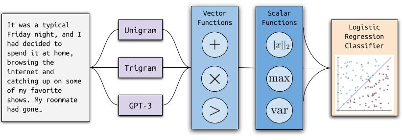

# Ghostbuster: Detecting Text Ghostwritten by Large Language Models ([https://arxiv.org/abs/2305.15047v1](https://arxiv.org/abs/2305.15047v1))

We introduce Ghostbuster, a state-of-the-art system for detecting AI-generated text. Our method works by passing documents through a series of weaker language models and running a structured search over possible combinations of their features, then training a classifier on the selected features to determine if the target document was AI-generated. Crucially, Ghostbuster does not require access to token probabilities from the target model, making it useful for detecting text generated by black-box models or unknown model versions. In conjunction with our model, we release three new datasets of human and AI-generated text as detection benchmarks that cover multiple domains (student essays, creative fiction, and news) and task setups: document-level detection, author identification, and a challenge task of paragraph-level detection. Ghostbuster averages 99.1 F1 across all three datasets on document-level detection, outperforming previous approaches such as GPTZero and DetectGPT by up to 32.7 F1.



## Usage

### Installation

To use ghostbuster, install the requirements and the package as follows:
```
pip install -r requirements.txt
pip install -e .
```

You may also need to open a `python` shell to install the following nltk `brown` model:
```
import nltk
nltk.download('brown')
```

We provide the `classify.py` script to run a given text document through ghostbuster. Usage:
```
python3 classify.py --file INPUT_FILE_HERE --openai_key OPENAI_KEY
```

To run the experiment files, create a file called `openai.config` in the main directory with the following template:
```javascript
{
    "organization": ORGANIZATION,
    "api_key": API_KEY
}
```

## Disclaimer

We evaluate Ghostbuster on three datasets that represent a range of domains, but note that these datasets are not representative of all writing styles or topics and contain predominantly British and American English text. Thus, users wishing to apply Ghostbuster to real-world cases of potential off-limits usage of text generation (e.g., identifying ChatGPT-written student essays) should be wary that no model is infallible, and incorrect predictions by Ghostbuster are particularly likely when the text involved is shorter or in domains that are further from those examined in this paper. To avoid perpetuation of algorithmic harms due to these limitations, we discourage incorporation of Ghostbuster into any systems that automatically penalize students or other writers for alleged usage of text generation without human supervision.

### Note

Since pre-printing, we have altered the essay data to filter out de-anonymized examples. The filtered dataset contains 1444 human examples, and 1444 GPT examples.
